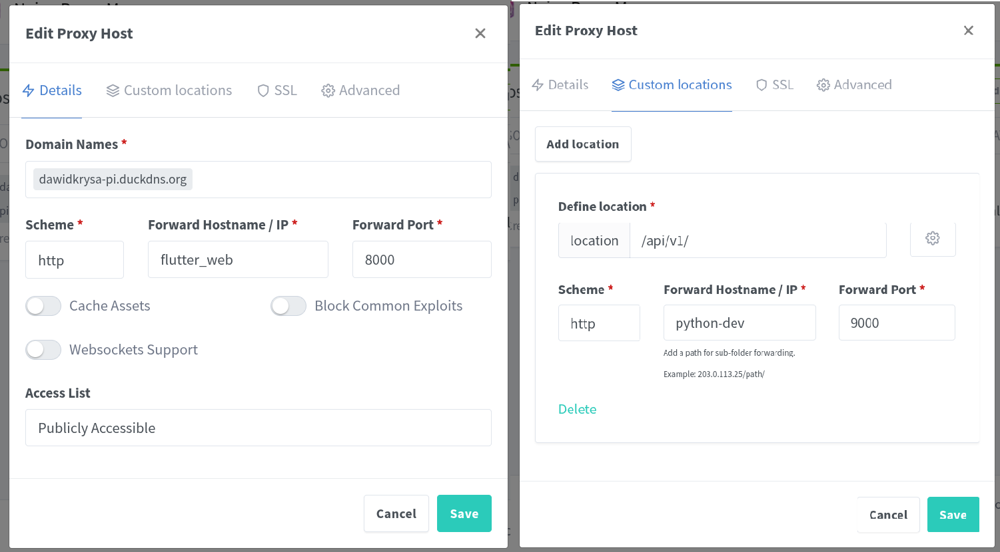

<a id="readme-top"></a>


<!-- PROJECT SHIELDS -->
[![Issues][issues-shield]][issues-url]
[![project_license][license-shield]][license-url]
[![LinkedIn][linkedin-shield]][linkedin-url]


<h3 align="center">Home Budget</h3>

  <p align="center">
    Personal home budget project
    <br />

</div>


<!-- TABLE OF CONTENTS -->
<details>
  <summary>Table of Contents</summary>
  <ol>
    <li>
      <a href="#about-the-project">About The Project</a>
      <ul>
        <li><a href="#built-with">Built With</a></li>
      </ul>
    </li>
    <li>
      <a href="#getting-started">Getting Started</a>
      <ul>
        <li><a href="#prerequisites">Prerequisites</a></li>
        <li><a href="#installation">Installation</a></li>
      </ul>
    </li>
    <li><a href="#usage">Usage</a></li>
    <li><a href="#roadmap">Roadmap</a></li>
    <li><a href="#contributing">Contributing</a></li>
    <li><a href="#license">License</a></li>
    <li><a href="#contact">Contact</a></li>
    <li><a href="#acknowledgments">Acknowledgments</a></li>
  </ol>
</details>


<!-- ABOUT THE PROJECT -->
## About The Project

A self-hosted personal budget tracking application inspired by **YNAB**, built with **Python (Flask)** and **PostgreSQL**, containerized using **Docker**. This project is aimed at gaining hands-on experience with backend architecture, Docker, and budgeting logic for a professional Python portfolio.
<p align="right">(<a href="#readme-top">back to top</a>)</p>

### Built With

[![Python][Python]][Python-url]
[![Docker][Docker]][Docker-url]
[![Flutter][Flutter]][Flutter-url]
[![PostgreSQL][PostgreSQL]][PostgreSQL-url]

<p align="right">(<a href="#readme-top">back to top</a>)</p>

## 📦 Project Structure

```
budget-project/                       
├── backend/                           # Backend related filed (Flask, PostgreSQL)
├── frontend/                          # Frontend related files (Flutter) 
├── images/                            # Project images and assets 
├── docker-compose.yml                 # Main docker compose configuration 
├── .gitignore                         # Git ignore rules 
├── LICENSE.txt                        # Project license 
└── README.md                          # Project documentation 
```

### Backend
```
.                     
├── Python/                            # Main Python application directory 
│   ├── app.py                         # Application entry point 
│   ├── config.py                      # Configuration settings 
│   ├── extensions.py                  # Database Extensions (eg. Database)  
│   ├── requirements.txt               # Python dependencies 
│   ├── models/                        # Database models 
│   │   ├── account/                   # Account-related models 
│   │   ├── ...                        # Other-related models 
│   │   ├── base.py                    # Base model definitions 
│   ├── routes/                        # API routes and endpoints 
│   │   ├── utils/                     # Route utilities 
│   │   │   └── db_utils.py            # Database helper functions 
│   │   ├── api.py                     # Main API blueprint 
│   │   ├── health.py                  # Health check endpoints 
│   │   └── ...                        # Other endpoints 
│   ├── tests/                         # Test suite 
│   │   └── unit/                      # Unit tests 
│   │       └── test_views.py          # View tests 
│   └── web/                           # Web interface components 
├── Postgres/                          # PostgreSQL related files 
├── docker-compose.yml                 # Docker compose configuration 
└── .env                               # Environment variables 
```
### Frontend
```
.                     
├── web_app/                           # Main Flutter application directory 
│   ├── ...                            # Other files
│   ├── lib/                           # Flutter app main code
│   └── pubspec/                       # Flutter dependencies
├── docker-compose.yml                 # Docker compose configuration 
└── .env                               # Environment variables 
```
<p align="right">(<a href="#readme-top">back to top</a>)</p>

<!-- GETTING STARTED -->
## 🚀 Getting Started

### Prerequisites

- Docker + Docker Compose

This application requires two .env files to store configuration and sensitive credentials. Create files named .env in the frontend and backend directory with the following variables:

#### Backend
```sh
# PostgreSQL configuration
POSTGRES_USER=dkrysa
POSTGRES_PASSWORD=dawidkrysa
POSTGRES_DB=budget

# Security & Auth
JWT_SECRET_KEY="..."
ACCESS_TOKEN_EXPIRE_MINUTES=30
ALGORITHM=ES256
PRIVATE_KEY="..."    # your ES256 private key
PUBLIC_KEY="..."     # your ES256 public key
INITIAL_ADMIN_EMAIL=dawidpkrysa@gmail.com
INITIAL_ADMIN_PASSWORD=dawidkrysa

# Networking & Hosting (DuckDNS)
DUCKDNS_SUBDOMAIN=dawidkrysa
DUCKDNS_TOKEN="..."  # your duckDNS token
VIRTUAL_HOST=dawidkrysa.duckdns.org

# Flask
FLASK_ENV=development
FLASK_DEBUG=1
FLASK_APP=app.py
FLASK_SECRET_KEY="..." # your secret key
```
#### Frontend
```sh
# API endpoint configuration
API_URL=https://dawidkrysa-pi.duckdns.org/api/v1
```

### Installation

1. Clone the repo
   ```sh
   git clone https://github.com/dawidkrysa/budget-project.git
   ```
2. Run Docker Compose
   ```sh
   docker compose run -d
   ```
3. Configure [DuckDNS](https://www.duckdns.org/)

4. Configure [Nginx Proxy Manager](https://nginxproxymanager.com/setup/#initial-run)

 

PostgreSQL runs on port `5432`, initialized with schema from `init.sql`.
Nginx Proxy Manager runs on port `81`.

<p align="right">(<a href="#readme-top">back to top</a>)</p>

<!-- USAGE EXAMPLES -->
## 📖 Usage

Use this space to show useful examples of how a project can be used. Additional screenshots, code examples and demos work well in this space. You may also link to more resources.

_For more examples, please refer to the [Documentation](https://example.com)_

<p align="right">(<a href="#readme-top">back to top</a>)</p>


<!-- ROADMAP -->
## ✨ Roadmap

### ✅ Core Features
- [x] Dockerized PostgreSQL + Flask app
- [ ] User authentication (login, registration)
- [ ] Create/read/update/delete (CRUD) for:
  - [ ] Accounts
  - [X] Payees
  - [ ] Categories (with main/sub support)
  - [X] Transactions
  - [X] Budget assignments per category/month
- [ ] Basic dashboard (list of transactions, budget overview)

### 🧱 Backend Tasks
- [X] Flask blueprints for modular code
- [X] PostgreSQL schema (based on ERD)
- [X] Seed scripts for dev setup (`data.sql`)
- [X] Use SQLAlchemy

### 💻 Frontend Tasks
- [ ] Flutter pages
- [ ] Transaction form with validation
- [ ] Monthly budget editor

### 🔄 Budgeting Features
- [ ] Recurring transactions
- [ ] Carry-over category balances
- [ ] Split transactions

### 📈 Reports & Analytics
- [ ] Spending per category/month
- [ ] Budget vs Actual
- [ ] Trends over time

### 📬 User Features
- [ ] Forgot password & reset flow
- [ ] User profile page (change email/name)

<p align="right">(<a href="#readme-top">back to top</a>)</p>

## 🧠 Planned Features

See the [open issues](https://github.com/dawidkrysa/budget-project/issues) for a full list of proposed features (and known issues).

<p align="right">(<a href="#readme-top">back to top</a>)</p>

## 🛠️ Tech Stack

- **Backend:** Python, Flask
- **Database:** PostgreSQL
- **DevOps:** Docker, Docker Compose
- **Frontend:** Flutter

<p align="right">(<a href="#readme-top">back to top</a>)</p>

<!-- LICENSE -->
## 📄 License

Distributed under the Unlicense License. See `LICENSE.txt` for more information.

<p align="right">(<a href="#readme-top">back to top</a>)</p>

<!-- CONTACT -->
## 📬 Contact

Developed by [Dawid Krysa](https://www.linkedin.com/in/dawid-krysa/)
Feel free to reach out via GitHub or LinkedIn.

<p align="right">(<a href="#readme-top">back to top</a>)</p>

<!-- ACKNOWLEDGMENTS -->
## 🙏 Acknowledgments

* Inspired by [YNAB](https://www.youneedabudget.com/)
* Flask and Docker documentation
* Use Raspberry Pi as the Server


<p align="right">(<a href="#readme-top">back to top</a>)</p>


<!-- MARKDOWN LINKS & IMAGES -->
<!-- https://www.markdownguide.org/basic-syntax/#reference-style-links -->
[issues-shield]: https://img.shields.io/github/issues/dawidkrysa/budget-project.svg?style=for-the-badge
[issues-url]: https://github.com/dawidkrysa/budget-project/issues
[license-shield]: https://img.shields.io/github/license/dawidkrysa/budget-project?label=license&style=for-the-badge
[license-url]: https://github.com/dawidkrysa/budget-project/blob/master/LICENSE.txt
[linkedin-shield]: https://img.shields.io/badge/-LinkedIn-black.svg?style=for-the-badge&logo=linkedin&colorB=555
[linkedin-url]: https://linkedin.com/in/dawid-krysa
[product-screenshot]: images/screenshot.png
[Python]: https://img.shields.io/badge/python-3670A0?style=for-the-badge&logo=python&logoColor=ffdd54
[Python-url]: https://www.python.org/
[Docker]: https://img.shields.io/badge/docker-257bd6?style=for-the-badge&logo=docker&logoColor=white
[Docker-url]: https://www.docker.com/
[Flutter]: https://img.shields.io/badge/flutter-02569B?style=for-the-badge&logo=flutter&logoColor=white
[Flutter-url]: https://flutter.dev/
[PostgreSQL]: https://img.shields.io/badge/postgresql-4169E1?style=for-the-badge&logo=postgresql&logoColor=white
[PostgreSQL-url]: https://www.postgresql.org/